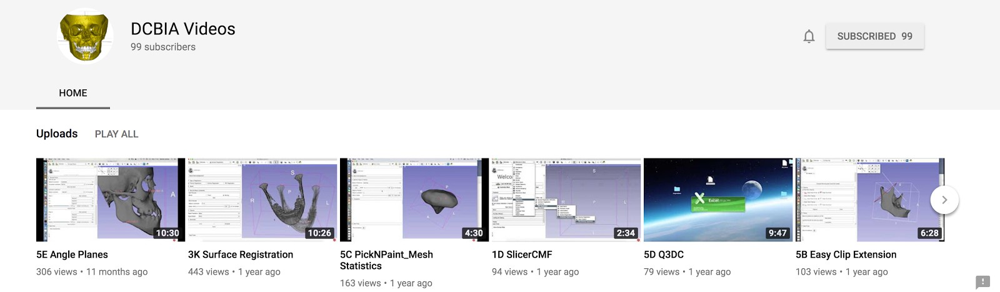

General Slicer guide
---------------------
* [Slicer training](http://www.slicer.org/slicerWiki/index.php/Documentation/Nightly/Training)

Tutorials for the finer steps
---------------------
* [DCBIA Youtube channel](https://www.youtube.com/user/DCBIA)

For users
---------------------
* Please, address your questions to the [SlicerCMF Discourse Forum](https://discourse.slicer.org/c/community/slicercmf).
