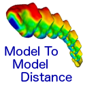
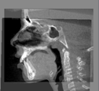

What can I do using SlicerCMF?
---------------------
SlicerCMF is the dissemination vehicle of powerful dental image analysis methodology based on 3D Slicer open-source software. SlicerCMF include registration, segmentation and quantification functionality modules that can support patient-specific decision making and assessment of the disease progression.

| --------- | --- |
||Included in SlicerCMF:|
| --------- | --- |
|[][ShapePopulationViewer] | ShapePopulationViewer is a software that allows you to dynamically interact with multiple surfaces at the same time. It is very useful for visualization and comparison of 3D surfaces by also displaying the associated pointwise data (scalar or vector maps) via customizable colormaps.|
| --------- | --- |
[][EasyClip] | This Module is used to clip and close one or several models according to a predetermined plane. Planes can be saved and reused.|
| --------- | --- |
|[][DatabaseInteractor] | This extension contains multiple panels that allow the user to manage data from a web database. The data displayed in this extension dynamically reacts with user local folders and online database. The user should login with the same credentials than on the server entered as input.|
| --------- | --- |
|[][ModelToModelDistance] | This extension computes a point by point distance between two models. The distance can be signed or unsigned. The output volume has the same number of points as the first input volume. The distances are saved as in the model as a point data array under the name "Distance" which is added to the input point and cell arrays already in the first input file. |
| --------- | --- |
| [][AnglePlanes] | This module is used to calculate the angle between two planes. The user selects already loaded planes or they can define a plane by using three landmarks.|
| --------- | --- |
|[][MeshStatistics] | This module computes descriptive statistics (min, max, avg, std, 5th per, 15th per, 15th per, 75th per, 85th per and 99th per) on data fields of a model or models. The statistics can be computed over predefined regions (selected with Pick and Paint) or the entire model. |
| --------- | --- |
|[][PickAndPaint] | This module selects a region of interest (ROI) in a model or models. The user selects a landmark and a number of vertices to define the size of the ROI, and this information gets propagated to the rest of the models in case of having multiple ones. |
| --------- | --- |
|[][CMFreg] | This module performs region based registration. |
| --------- | --- |
|[][MeshToLabelMap] | This module scan converts a model into a binary segmentation image volume.|
| --------- | --- |
| [][Q3DC] | Q3DC means Quantitative 3D Cephalometrics, meaning head measurements used in craniofacial surgery. Using placed fiducials, it allows users to compute 2D angles: Yaw, Pitch and Roll; and decompose the 3D distance into the three different components: R-L , A-P and S-I. It is possible to compute the middle point between two fiducials and export the values.|

[ShapePopulationViewer]: https://www.slicer.org/wiki/Documentation/4.10/Extensions/ShapePopulationViewer
[EasyClip]: https://www.slicer.org/wiki/Documentation/4.10/Extensions/EasyClip
[DatabaseInteractor]: https://www.slicer.org/wiki/Documentation/4.10/Extensions/DatabaseInteractor
[ModelToModelDistance]: https://www.slicer.org/wiki/Documentation/4.10/Extensions/ModelToModelDistance
[AnglePlanes]: https://www.slicer.org/wiki/Documentation/4.10/Extensions/AnglePlanes
[MeshStatistics]: https://www.slicer.org/wiki/Documentation/4.10/Extensions/MeshStatistics
[PickAndPaint]: https://www.slicer.org/wiki/Documentation/4.10/Extensions/PickAndPaint
[CMFreg]: https://www.slicer.org/wiki/Documentation/4.10/Extensions/CMFreg
[MeshToLabelMap]: https://www.slicer.org/wiki/Documentation/4.10/Extensions/MeshToLabelMap
[Q3DC]: https://www.slicer.org/wiki/Documentation/4.10/Extensions/Q3DC
