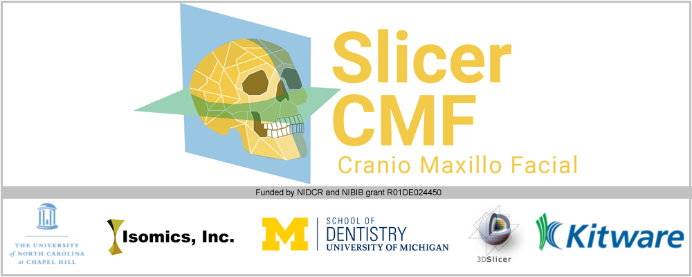

What can I do using SlicerCMF?
---------------------
SlicerCMF is the dissemination vehicle of powerful dental image analysis methodology based on 3D Slicer open-source software. SlicerCMF supports patient-specific decision making and assessment of the disease progression via registration of serial images.

* Description of extensions here

 images in 3D Slicer.")

